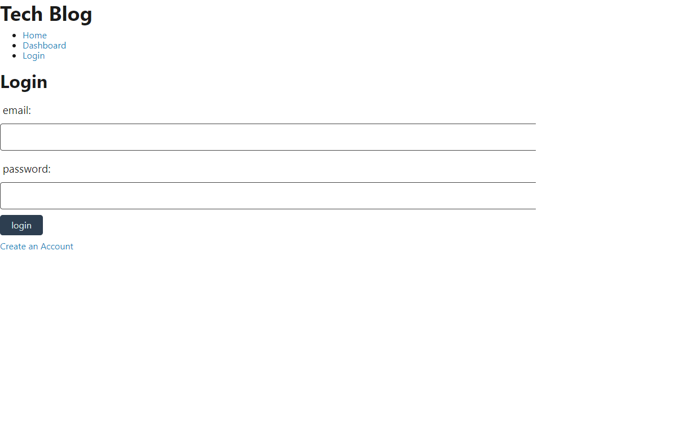

# curriecoder-tech-blog

Deployed: https://peaceful-woodland-22604.herokuapp.com/

Repo: https://github.com/curriecoder/curriecoder-tech-blog

## Description

This project was created as a way to try out a basic full stack application using Bcrypt, Sequelize and Express. There were many hurdles along the way, not the least of which was time. The goal for the project was to make a tech blog word press style app that could create users and allow for posts to be made. 

## Installation

There are no installations required to use this application. Use the deployed link above to access the app.

## Usage
Test login: test@test.com  password: password

To use the application, follow the link above to the deployed page on Heroku. There, users can make an account and start posting blog entries about technologies that are of interest to them.

## Credits

I would like to thank the instructor and support staff at the UPenn LPS Coding Bootcamp for their support and prioritization of the students. As always, thank you to the online community of web developers and the vast knowledge base that everyone has made available, to those willing to look.
Special thanks to Laura Cole for getting me through this one - GitHub profile: 
https://github.com/LauraCole1900

## License

MIT License

Copyright (c) [2021] [Andrew Currie]

Permission is hereby granted, free of charge, to any person obtaining a copy
of this software and associated documentation files (the "Software"), to deal
in the Software without restriction, including without limitation the rights
to use, copy, modify, merge, publish, distribute, sublicense, and/or sell
copies of the Software, and to permit persons to whom the Software is
furnished to do so, subject to the following conditions:

The above copyright notice and this permission notice shall be included in all
copies or substantial portions of the Software.

THE SOFTWARE IS PROVIDED "AS IS", WITHOUT WARRANTY OF ANY KIND, EXPRESS OR
IMPLIED, INCLUDING BUT NOT LIMITED TO THE WARRANTIES OF MERCHANTABILITY,
FITNESS FOR A PARTICULAR PURPOSE AND NONINFRINGEMENT. IN NO EVENT SHALL THE
AUTHORS OR COPYRIGHT HOLDERS BE LIABLE FOR ANY CLAIM, DAMAGES OR OTHER
LIABILITY, WHETHER IN AN ACTION OF CONTRACT, TORT OR OTHERWISE, ARISING FROM,
OUT OF OR IN CONNECTION WITH THE SOFTWARE OR THE USE OR OTHER DEALINGS IN THE
SOFTWARE.